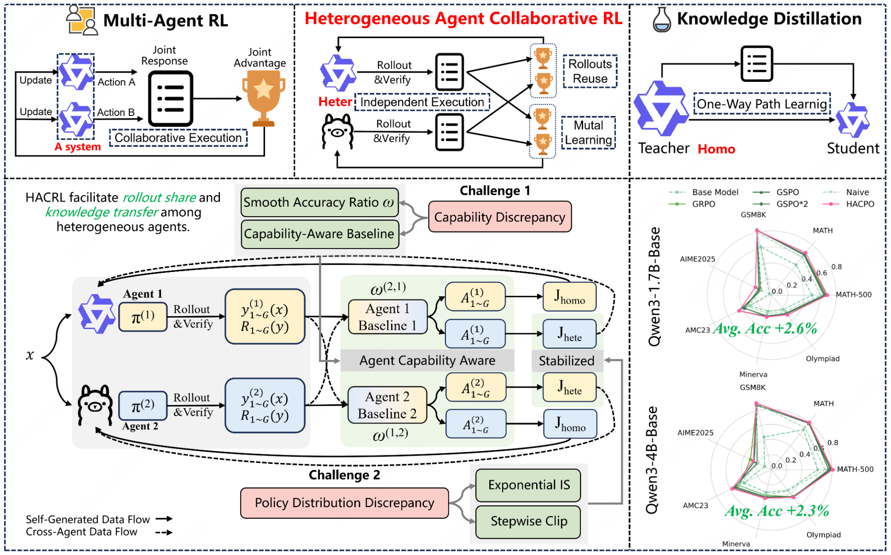

# HACPO on verl V1

[](https://arxiv.org/abs/2603.02604)
[](https://huggingface.co/papers/2603.02604)

This branch migrates Heterogeneous Agent Collaborative Policy Optimization (HACPO), introduced in *Heterogeneous Agent Collaborative Reinforcement Learning*, to the verl V1 training engine. It is based on verl commit [`bf48903d`](https://github.com/verl-project/verl/commit/bf48903d93e4618531d3bbae96551a889007dd8b), with the HACPO implementation under [`recipe/hacpo`](recipe/hacpo/README.md).

The results reported in the paper correspond to the original implementation on the `main` branch. This branch provides the V1 runtime and launch configurations for continued development on newer verl infrastructure.



*Given the same prompts, heterogeneous policies contribute trajectories to a shared pool. HACPO applies capability- and distribution-aware corrections when updating each policy. Figure from the paper.*

## Implementation

At each training step, both policies generate responses for the same prompt batch. The verified responses are collected into a tokenizer-neutral trajectory pool, and each policy is updated from the complete pool. Responses produced by the other policy are reconstructed from text with the learner's tokenizer, while their source-policy sequence log-probabilities are retained for the HACPO objective.

The objective implements Agent-Capability-Aware Advantage Estimation, the Model Capabilities Discrepancy Coefficient, Exponential Importance Sampling, and Stepwise Clipping. Each policy keeps an independent model, tokenizer, reference policy, rollout engine, optimizer, and checkpoint state.

The two policy runtimes share one eight-GPU pool. They are activated sequentially, with FSDP state offload and sleeping vLLM replicas used between phases. The current implementation targets synchronous, text-only, single-turn mutual learning between two policies; the runtime is agent-indexed to leave a clean extension point for future multi-agent work.

The main components are:

| Component | Role |
| --- | --- |
| [`main_hacpo.py`](recipe/hacpo/main_hacpo.py) | Initializes Ray, the two policy runtimes, and the trainer. |
| [`hacpo_ray_trainer.py`](recipe/hacpo/hacpo_ray_trainer.py) | Coordinates rollouts, rewards, trajectory exchange, policy updates, validation, and joint checkpoints. |
| [`hacpo_trajectory.py`](recipe/hacpo/hacpo_trajectory.py) | Builds tokenizer-neutral trajectories and learner-specific training batches. |
| [`hacpo_workers.py`](recipe/hacpo/hacpo_workers.py) | Connects HACPO to verl V1 training and rollout workers. |
| [`hacpo_core_algos.py`](recipe/hacpo/hacpo_core_algos.py) | Implements HACPO advantages, importance weighting, and clipping. |
| [`hacpo_config.py`](recipe/hacpo/hacpo_config.py) | Defines the agent and algorithm configuration. |

See the [recipe README](recipe/hacpo/README.md) for the full data flow and launcher options.

## Installation

Install the vLLM/FSDP environment supported by the pinned verl revision, then install this checkout and the additional trajectory-queue dependency:

```bash
pip install -e .
pip install TransferQueue==0.1.8
```

The provided presets use eight NVIDIA GPUs, the 7.5k MATH training split, and MATH-500 validation during training. The seven evaluation sets used in the paper are MATH-500, MATH, GSM8K, AIME 2025 (`test16`), AMC 2023, Minerva Math, and OlympiadBench. Data should be converted to verl's `RLHFDataset` parquet format.

## Training

Set local model and data paths, then launch one of the tested pairs:

```bash
export QWEN3_4B_MODEL=/models/Qwen3-4B-Base
export QWEN3_1P7B_MODEL=/models/Qwen3-1.7B-Base
export TRAIN_FILE=/data/math/train.parquet
export VAL_PATHS=/data/math500.parquet
export CHECKPOINT_DIR=/outputs/hacpo/checkpoints
export TENSORBOARD_DIR=/outputs/hacpo/tensorboard

bash recipe/hacpo/run_hacpo_qwen3_4b_qwen3_1p7b_8gpu.sh
```

For Qwen3-4B-Base and Llama-3.2-3B-Instruct, also set `LLAMA3P2_3B_MODEL` and run:

```bash
bash recipe/hacpo/run_hacpo_qwen3_4b_llama3p2_3b_8gpu.sh
```

Both presets use a prompt batch size of 128, eight responses per prompt, a maximum response length of 4096, one actor epoch, greedy MATH-500 validation every three steps, TensorBoard logging, and a final joint checkpoint.

## Citation

```bibtex
@article{zhang2026hacrl,
  title   = {Heterogeneous Agent Collaborative Reinforcement Learning},
  author  = {Zhang, Zhixia and Huang, Zixuan and Li, Gongxun and Wang, Huaiyang and Yuan, Chengyi and Xia, Xin and Wang, Deqing and Zhuang, Fuzhen and Ma, Shuai and Ding, Ning and Yang, Yaodong and Li, Jianxin and Ban, Yikun},
  journal = {arXiv preprint arXiv:2603.02604},
  year    = {2026}
}
```
